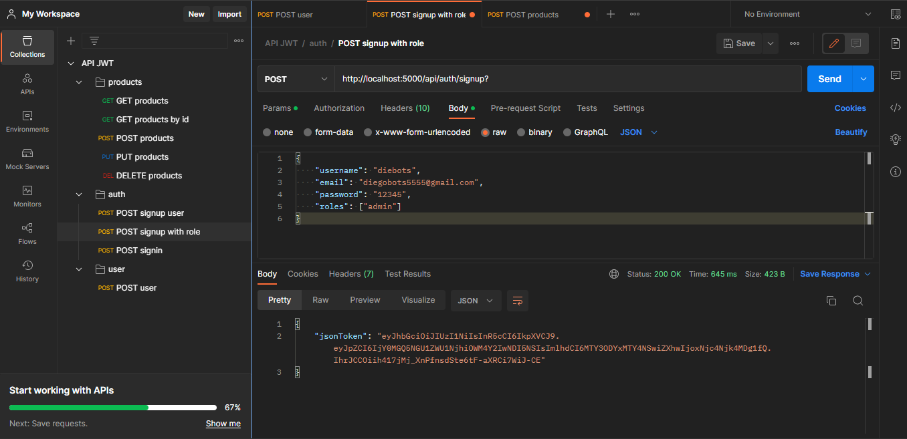
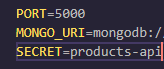
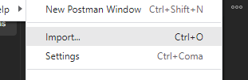
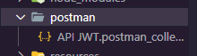

## JSON WEB TOKENS & Authentication with NodeJS



### Descripción
Una API REST con validaciones, roles y autenticaciones con JWT usando paquetes npm de NodeJS como JSONWEBTOKEN como autenticación para los roles y Bcrypt para hashear las contraseñas.
Puedes probar esta API usando Postman para importar los request.

<div align="center">


</div>

## Instrucciones

Para Ejecutar el proyecto debes seguir los pasos siguientes:

- Tener REST Client instalado, en este caso POSTMAN

<div align = "center"> 


</div>

- Ejecutar el comando:

```
 $ npm install
```

- Crear un archivo .env en la raiz del proyecto y agregar las variables PORT, MONGO_URI y SECRET

<div align = "center"> 



</div>

- Ejecutar babel para producción

```
 $ npm run build
```

- Ejecutar el Proyecto


```
 $ npm run start
```

- Importar las request en tu REST Client

<div align = "center"> 



</div>

- Importa desde la carpeta "postman" del proyecto

<div align = "center"> 



</div>
